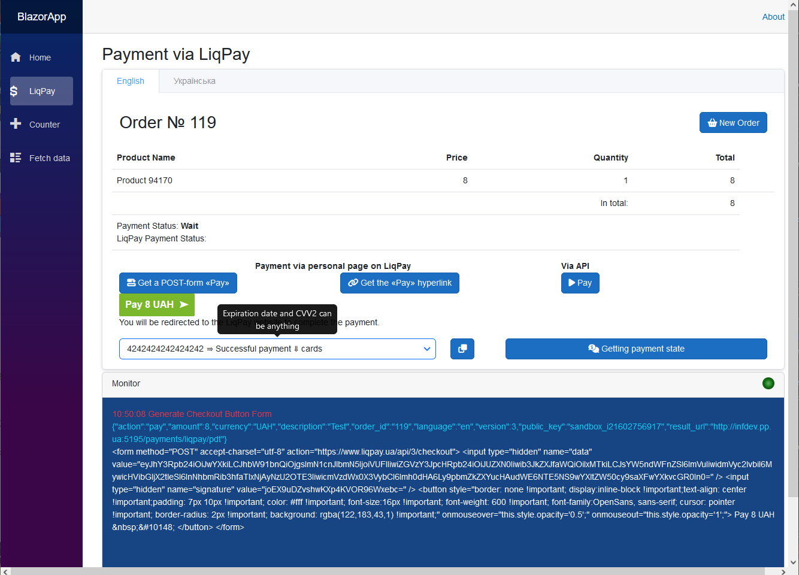
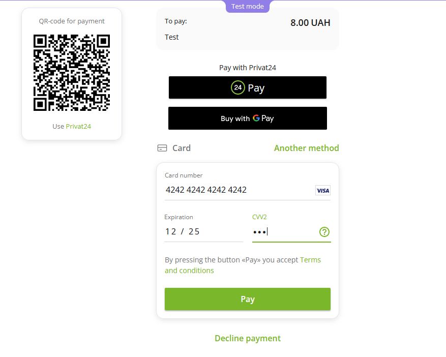
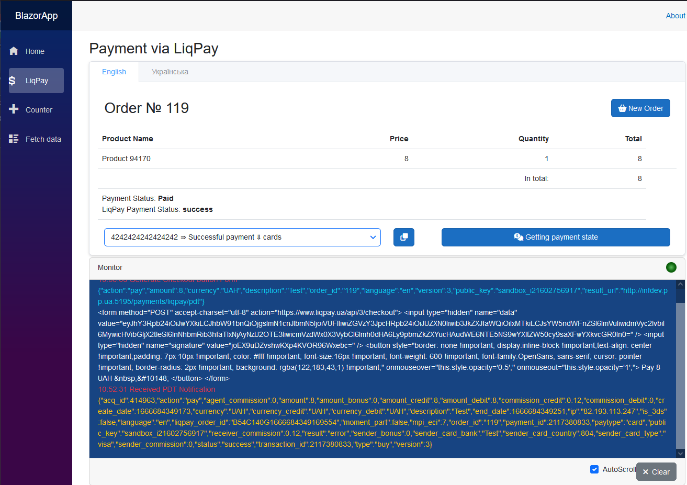

# Blazor App & SKit.LiqPaySDK [⇑](index.md)

## General information

Using the SDK.
Sample Blazor Server app with minimal API architecture.

Functionality:

- formation of payment buttons
- payment through personal page LiqPay
- receiving PDT notifications
- card payment via API
- getting payment statе
- logging of exchange with LiqPay

Before running the demo application:

- create an account in LiqPay, copy your keys and add them to appsettings.json
- to receive PDT notifications from LiqPay, change the application domain and port in appsettings.json (PdtUrl, IpnUrl) to suit you, and, if necessary, in launchSettings.json (applicationUrl).

  You must have a static external IP at your workplace.
  You can also link your external IP to a domain, which can be provided free of charge from [pp.ua domain registrar](https://pp.ua/).

The output files of the operations for generating a payment button and exchanging with LiqPay are placed in the solution folder **assets/outputs/BlazorApp**.

## Registering SDK Services

The following extension has been added to register SDK services in the application

*LiqPayServiceCollectionExtensions.cs*
``` csharp
using SKit.LiqPay.SDK;
using Microsoft.Extensions.Configuration;

namespace Microsoft.Extensions.DependencyInjection
{
    public static class LiqPayServiceCollectionExtensions
    {
        public static IServiceCollection AddLiqPay(this IServiceCollection services,
						IConfiguration configuration)
        {
            // Registering the gateway options
            var liqPayGatewayOptions = new LiqPayGatewayOptions();
            configuration
				.GetSection(LiqPayGatewayOptions.LiqPayGatewaySection)
				.Bind(liqPayGatewayOptions);
            services.AddSingleton<LiqPayGatewayOptions>(liqPayGatewayOptions);

            // Registering the gateway base without HttpClient
            services.AddTransient<ILiqPayGatewayBase, LiqPayGatewayBase>();
            // Register custom gateway factory to 'LiqPay' with HttpClient
            services.AddHttpClient<ILiqPayGateway, LiqPayGateway>();

            // Registration of the service for providing Checkout buttons
            // for redirection to a personalized LiqPay payment page
            services.AddTransient<ILiqPayCheckoutButtonService, LiqPayCheckoutButtonService>();
            // Registration of service for working with checkout methods of 'LiqPay' API
            services.AddTransient<ILiqPayService, LiqPayService>();
            // Registration PDT Notification Listener from LiqPay 
            services.AddTransient<ILiqPayPdtListener, LiqPayPdtListener>();
            // Registration IPN Notification Listener from LiqPay
            services.AddTransient<ILiqPayIpnListener, LiqPayIpnListener>();
            return services;
        }
    }
}
```

## Appearance

Payment button received


Redirected to LiqPay payment page


Payment completed and PDT notification received

