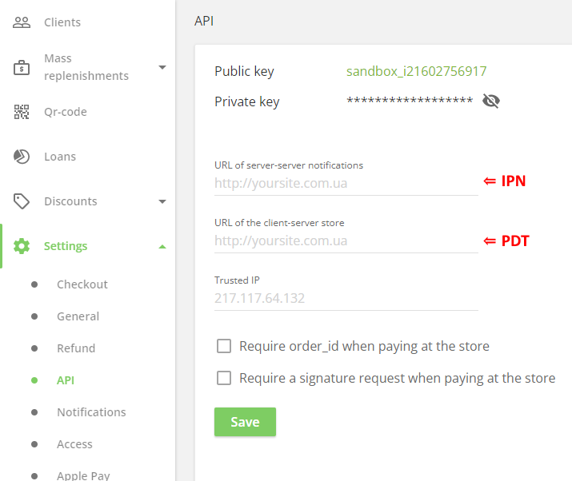

# PDT and IPN  [⇑](index.md)

## General information

### PDT

**PDT (Payment Data Transfer)** - notification of the payment state to the page of the store's website.

The payment service PDT system sends the order payment state to the merchant websites when payment is made through the payment service page. The user is redirected to this page through the payment button on the order completion page on the store's website.

Upon receipt of a PDT notification, the payment state can be displayed to the customer on the order confirmation page of the store's website.

PDT is preferred if the merchant site has a feature that requires immediate payment notification. Also, when paying through the payment button, there is no need for strict site security requirements, namely the presence of a [PCI DSS certificate](https://en.wikipedia.org/wiki/PCI_DSS).

PDT has a big drawback: it sends an order confirmation once and only once. As a result, when the PDT sends an acknowledgment, the store site must be running, otherwise it will never receive the message. You can usually get the payment status of an order in a separate on-demand request.

To receive a PDT notification on the merchant's website, the payment service is provided with the endpoint address

- with every payment request
- or it is enough to specify this address in the merchant's account on the payment service website.

**In LiqPay, the address for PDT notifications is set in the ResultUrl (result_url) request parameter**.

### IPN

**IPN (Instant Payment Notification)** - merchants can use it to automate back-office and administrative functions, including automatically completing payment for orders and providing customers with the payment state of those orders.

Merchants create an IPN listener endpoint on their store site,
and then specify its URL in your payment service account profile or in each request.

**In LiqPay, the URL for IPN notifications is specified in the ServerUrl (server_url) request parameter**.

This URL must be available globally because notifications about transactions will be sent to it. The IPN listener discovers and processes IPN messages using vendor server processes.

Although the payment service typically processes IPN messages quickly, the IPN does not sync with activity on the merchant's website.

Internet connection is not always 100% reliable and IPN messages can be lost or delayed. Some IPN services may automatically resend messages until the listener acknowledges them.
An alternative is to request the payment status from the on-demand merchant site.

## Cabinet LiqPay

