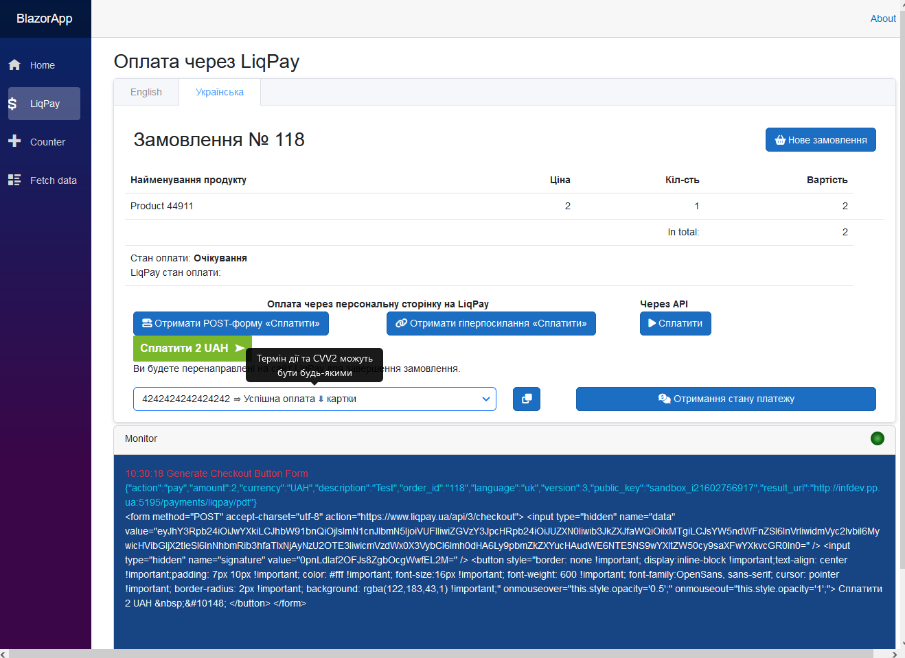
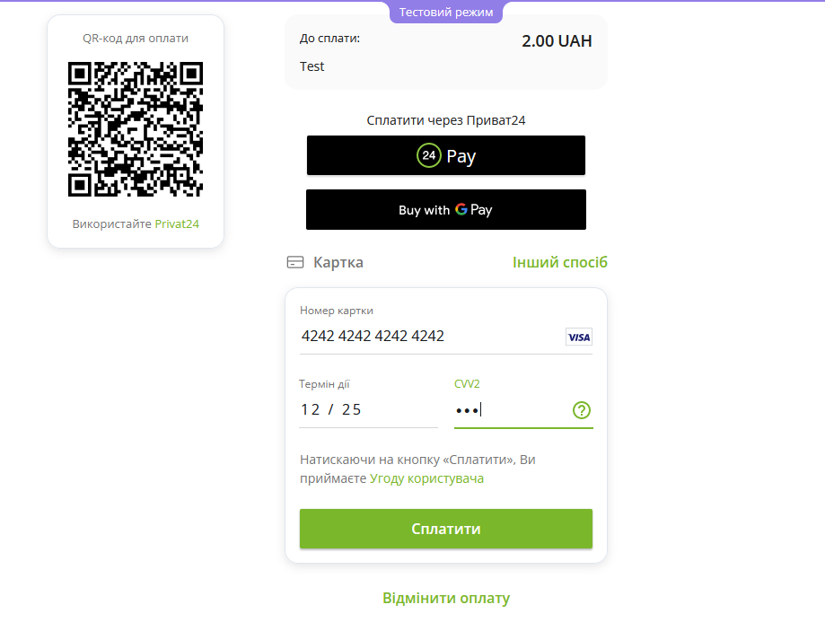
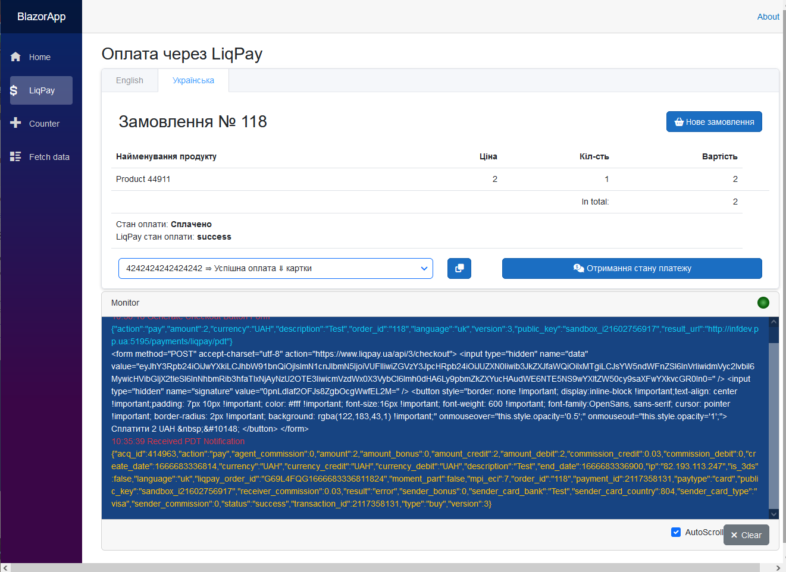

# Blazor App & SKit.LiqPaySDK [⇑](index.md)

## Общие сведения

Применение SDK.
Пример приложения на платформе Blazor Server с минимальной архитектурой API.

Функциональность:

- формирование кнопок оплаты
- оплата через персональную страницу LiqPay
- прием PDT-уведомлений
- оплата карткой через API
- получение состояния платежа
- протоколирование обмена с LiqPay

Перед запуском демонстрационного приложения:

- создайте учетную запись в LiqPay, скопируйте свои ключи и пропишите их в appsettings.json
- для приема PDT-уведомлений от LiqPay измените домен приложения и порт в appsettings.json (PdtUrl, IpnUrl) на подходящие вам, и, при необходимости, в launchSettings.json (applicationUrl).

  На своем рабочем месте у вас должен быть статический внешний IP.
  Также вы можете связать свой внешний IP c доменом, который может быть предоставлен бесплатно от [регистратора доменов pp.ua](https://pp.ua/).

Выходные файлы операций формирования платежной кнопки и обмена с LiqPay помещаются в папку решения **assets/outputs/BlazorApp**.

## Регистрация сервисов SDK

Для регистрации сервисов SDK в приложении добавлено следующее расширение

*LiqPayServiceCollectionExtensions.cs*
``` csharp
using SKit.LiqPay.SDK;
using Microsoft.Extensions.Configuration;

namespace Microsoft.Extensions.DependencyInjection
{
    public static class LiqPayServiceCollectionExtensions
    {
        public static IServiceCollection AddLiqPay(this IServiceCollection services,
						IConfiguration configuration)
        {
            // Registering the gateway options
            var liqPayGatewayOptions = new LiqPayGatewayOptions();
            configuration
				.GetSection(LiqPayGatewayOptions.LiqPayGatewaySection)
				.Bind(liqPayGatewayOptions);
            services.AddSingleton<LiqPayGatewayOptions>(liqPayGatewayOptions);

            // Registering the gateway base without HttpClient
            services.AddTransient<ILiqPayGatewayBase, LiqPayGatewayBase>();
            // Register custom gateway factory to 'LiqPay' with HttpClient
            services.AddHttpClient<ILiqPayGateway, LiqPayGateway>();

            // Registration of the service for providing Checkout buttons
            // for redirection to a personalized LiqPay payment page
            services.AddTransient<ILiqPayCheckoutButtonService, LiqPayCheckoutButtonService>();
            // Registration of service for working with checkout methods of 'LiqPay' API
            services.AddTransient<ILiqPayService, LiqPayService>();
            // Registration PDT Notification Listener from LiqPay 
            services.AddTransient<ILiqPayPdtListener, LiqPayPdtListener>();
            // Registration IPN Notification Listener from LiqPay
            services.AddTransient<ILiqPayIpnListener, LiqPayIpnListener>();
            return services;
        }
    }
}
```

## Внешний вид

Получена платежная кнопка


Перенаправлено на страницу оплаты LiqPay


Оплата завершена и получено PDT-уведомление

