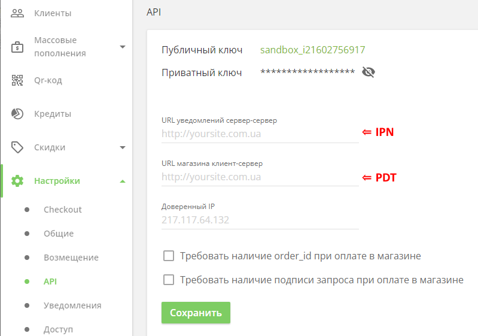

# PDT и IPN  [⇑](index.md)

## Общие сведения

### PDT

**PDT (Payment Data Transfer)** - передача платежных данных, уведомление о состоянии платежа на страницу сайта магазина.

Система PDT платежного сервиса отправляет состояние оплат заказов на сайты магазинов, когда осуществляется оплата через страницу платежного сервиса. На эту страницу перенаправляется пользователь через платежную кнопку на странице завершения оформления заказа на сайте магазина.

При получении PDT-уведомления состояние оплаты может быть отображено заказчику на странице подтверждения заказа сайта магазина.

PDT предпочтительнее, если на сайте магазина есть функция, требующая немедленного уведомления об оплате. Также при оплате через платежную кнопку нет необходимости в жестких требованиях к сайту по безопасности, а именно наличие [сертификата PCI DSS](https://ru.wikipedia.org/wiki/PCI_DSS).

PDT имеет большой недостаток: он отправляет подтверждение заказа один раз и только один раз. В результате, когда PDT отправляет подтверждение, сайт магазина должен работать, в противном случае он никогда не получит сообщение. Обычно можно получить состояние оплаты заказа отдельным запросом по требованию.

Для получения PDT-уведомления на сайте магазина платежному сервису передается адрес конечной точки

- с каждым запросом на оплату
- или достаточно определить этот адрес в кабинете продавца на сайте платежного сервиса.

**В LiqPay адрес для PDT-уведомлений задается в параметре запроса ResultUrl (result_url)**.

### IPN

**IPN (Instant Payment Notification)** - мгновенное уведомление о платеже.
Продавцы могут использовать его для автоматизации бэк-офиса и административных функций, включая автоматическое выполнение оплаты заказов и предоставление клиентам состояния оплаты этих заказов.

Продавцы создают конечную точку прослушивателя IPN на своем сайте магазина,
а затем указывают ее URL-адрес в своем профиле учетной записи платежного сервиса или же в каждом запросе.

**В LiqPay URL-адрес для IPN-уведомлений задается в параметре запроса ServerUrl (server_url)**.

Этот URL обязательно должен быть доступен глобально, т.к. на него будут приходить уведомления о проведении операций. Прослушиватель IPN обнаруживает и обрабатывает сообщения IPN с помощью серверных процессов продавца.

Хотя платежный сервис обычно обрабатывает IPN-сообщения быстро, IPN не синхронизируется с действиями на веб-сайте продавца.

Подключение к Интернету не всегда на 100% надежно, и сообщения IPN могут быть потеряны или задержаны. Некоторые службы IPN могут автоматически повторно отправлять сообщения до тех пор, пока прослушиватель не подтвердит их.
Альтернативой является запрос на получение состояния платежа с сайта магазина по требованию.

## Кабинет LiqPay

