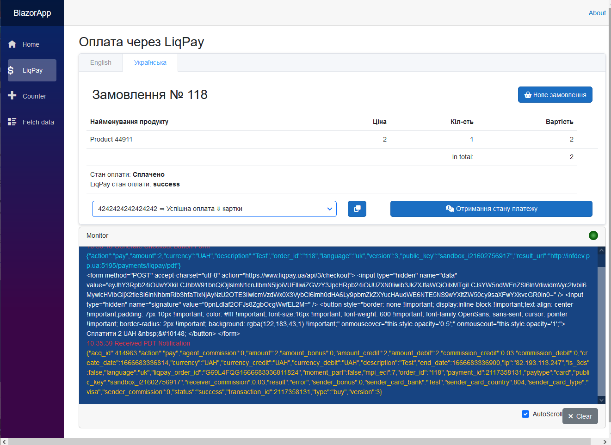

# Blazor App & SKit.LiqPaySDK [⇑](index.md)

## Загальні відомості

Використання SDK.
Приклад додатку на платформі Blazor Server із мінімальною архітектурою API.

Функціональність:

- формування кнопок оплати
- оплата через персональну сторінку LiqPay
- прийом PDT-повідомлень
- оплата карткою через API
- отримання стану платежу
- протоколювання обміну з LiqPay

Перед запуском демонстраційного додатку:

- створіть обліковий запис у LiqPay, скопіюйте свої ключі та пропишіть їх у appsettings.json
- для отримання PDT-повідомлень від LiqPay змініть домен програми та порт у appsettings.json (PdtUrl, IpnUrl) на відповідні вам, і, при необхідності, у launchSettings.json (applicationUrl).

  На своєму робочому місці у вас має бути статичний зовнішній IP.
  Також ви можете зв'язати свій зовнішній IP з доменом, який може бути наданий безкоштовно від [реєстратора доменів pp.ua](https://pp.ua/).

Вихідні файли операцій формування платіжної кнопки та обміну з LiqPay розміщуються в папці рішення **assets/outputs/BlazorApp**.

## Реєстрація сервісів SDK

Для реєстрації сервісів SDK у додатку додано наступне розширення

*LiqPayServiceCollectionExtensions.cs*
``` csharp
using SKit.LiqPay.SDK;
using Microsoft.Extensions.Configuration;

namespace Microsoft.Extensions.DependencyInjection
{
    public static class LiqPayServiceCollectionExtensions
    {
        public static IServiceCollection AddLiqPay(this IServiceCollection services,
						IConfiguration configuration)
        {
            // Registering the gateway options
            var liqPayGatewayOptions = new LiqPayGatewayOptions();
            configuration
				.GetSection(LiqPayGatewayOptions.LiqPayGatewaySection)
				.Bind(liqPayGatewayOptions);
            services.AddSingleton<LiqPayGatewayOptions>(liqPayGatewayOptions);

            // Registering the gateway base without HttpClient
            services.AddTransient<ILiqPayGatewayBase, LiqPayGatewayBase>();
            // Register custom gateway factory to 'LiqPay' with HttpClient
            services.AddHttpClient<ILiqPayGateway, LiqPayGateway>();

            // Registration of the service for providing Checkout buttons
            // for redirection to a personalized LiqPay payment page
            services.AddTransient<ILiqPayCheckoutButtonService, LiqPayCheckoutButtonService>();
            // Registration of service for working with checkout methods of 'LiqPay' API
            services.AddTransient<ILiqPayService, LiqPayService>();
            // Registration PDT Notification Listener from LiqPay 
            services.AddTransient<ILiqPayPdtListener, LiqPayPdtListener>();
            // Registration IPN Notification Listener from LiqPay
            services.AddTransient<ILiqPayIpnListener, LiqPayIpnListener>();
            return services;
        }
    }
}
```

## Зовнішній вигляд

Отримано платіжну кнопку


Перенаправлено на сторінку оплати LiqPay


Оплату завершено та отримано PDT-повідомлення

