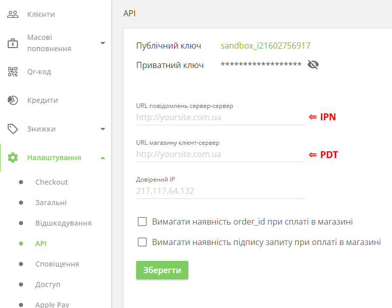

# PDT и IPN  [⇑](index.md)

## Загальні відомості

### PDT

**PDT (Payment Data Transfer)** - передача платіжних даних, повідомлення про стан платежу на сторінку сайту магазину.

Система PDT платіжного сервісу надсилає стан оплати замовлень на сайти магазинів, коли здійснюється оплата через сторінку платіжного сервісу. На цю сторінку перенаправляється користувач через платіжну кнопку на сторінці завершення оформлення замовлення на сайті магазину.

При отриманні сповіщення PDT стан оплати може бути відображений замовнику на сторінці підтвердження замовлення сайту магазину.

PDT краще, якщо на сайті магазину є функція, що вимагає негайного повідомлення про оплату. Також при оплаті через платіжну кнопку немає необхідності в жорстких вимогах до сайту безпеки, а саме наявність [сертифіката PCI DSS](https://uk.wikipedia.org/wiki/PCI_DSS).

PDT має великий недолік: він відправляє підтвердження замовлення один раз і лише один раз. В результаті, коли PDT відправляє підтвердження, сайт магазину має працювати, інакше він ніколи не отримає повідомлення. Зазвичай можна отримати стан оплати замовлення окремим запитом на вимогу.

Для отримання PDT-повідомлення на сайті магазину платіжному сервісу передається адреса кінцевої точки

- з кожним запитом на оплату
- або достатньо визначити цю адресу в кабінеті продавця на сайті платіжного сервісу.

**У LiqPay адреса для PDT-повідомлень задається у параметрі запросу ResultUrl (result_url)**.

### IPN

**IPN (Instant Payment Notification)** - миттєве повідомлення про платіж.
Продавці можуть використовувати його для автоматизації бек-офісу та адміністративних функцій, включаючи автоматичне виконання оплати замовлень та надання клієнтам стану оплати цих замовлень.

Продавці створюють кінцеву точку прослуховувача IPN на своєму сайті магазину,
а потім вказують її URL-адресу у своєму профілі облікового запису платіжного сервісу або в кожному запиті.

**У LiqPay URL-адреса для IPN-повідомлень задається у параметрі запросу ServerUrl (server_url)**.

Цей URL обов'язково має бути доступний глобально, на нього надходитимуть повідомлення про проведення операцій. Прослуховувач IPN виявляє та обробляє повідомлення IPN за допомогою серверних процесів продавця.

Хоча платіжний сервіс зазвичай обробляє IPN-повідомлення швидко, IPN не синхронізується з діями на веб-сайті продавця.

Підключення до Інтернету не завжди на 100% надійне, і повідомлення IPN можуть бути втрачені або затримані. Деякі служби IPN можуть автоматично надсилати повідомлення до тих пір, поки прослуховувач не підтвердить їх.
Альтернативою є запит на отримання стану платежу із сайту магазину на вимогу.

## Кабинет LiqPay

